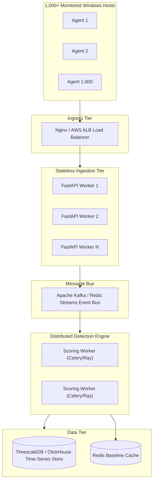

# SentinelLog: Comprehensive Viva Defense & Academic Evaluation Guide

**Course**: Practical Data Science (Course Code: BE05000231)  
**Curriculum**: Gujarat Technological University (GTU) — B.E. Semester V  
**Project**: SentinelLog — Production-Grade Hybrid SIEM, Threat Detection & Endpoint Telemetry Platform  

---

## Table of Contents
1. [Core Defense Question 1: Accuracy vs PR Metrics in Cyber Threat Detection](#q1-accuracy-vs-pr-metrics)
2. [Core Defense Question 2: SMOTE and the Data Leakage Pitfall](#q2-smote-data-leakage)
3. [Core Defense Question 3: Circular Reasoning in Rule-Labeling vs Ground Truth](#q3-circular-reasoning)
4. [Core Defense Question 4: Deep URL Multi-Pass Decoding & Evasion Neutralization](#q4-deep-decoding)
5. [Core Defense Question 5: Shannon Entropy for Obfuscation & DGA Detection](#q5-shannon-entropy)
6. [Core Defense Question 6: Sliding-Window Temporal Analysis for Brute Force](#q6-sliding-window-temporal)
7. [Core Defense Question 7: Isolation Forest Baseline vs Supervised Random Forest](#q7-isolation-forest-vs-rf)
8. [Core Defense Question 8: Windows Endpoint Agent Safety & Throttling](#q8-agent-safety)
9. [Core Defense Question 9: Adversarial Evasion & Hybrid Calibrated Scoring](#q9-adversarial-evasion)
10. [Core Defense Question 10: Horizontal Scaling Architecture (1,000+ Hosts)](#q10-horizontal-scaling)
11. [Core Defense Question 11: Privacy, Compliance & Credential Redaction](#q11-privacy-compliance)
12. [GTU Practical Syllabus Mapping & Pre-Submission Checklist](#gtu-practical-mapping)

---

<a name="q1-accuracy-vs-pr-metrics"></a>
### Q1: Why is Accuracy a Dangerous and Misleading Metric for Web Threat Detection?

#### The Imbalance Reality
In enterprise web servers, benign requests make up $99.8\%$ to $99.95\%$ of all incoming HTTP traffic; true malicious events (SQL injection, path traversal, command injection) represent less than $0.2\%$.

If a naive model predicts **Benign ($0$)** for every single incoming request:
$$\text{Accuracy} = \frac{TP + TN}{TP + TN + FP + FN} = \frac{0 + 9990}{0 + 9990 + 0 + 10} = 99.9\%$$

Despite presenting a seemingly stellar $99.9\%$ accuracy, the system has **$0\%$ recall**: every single data exfiltration attempt and backdoor injection passes through completely undetected.

#### Why Precision, Recall, and PR-AUC are Essential
In Security Operations Centers (SOC):
* **False Negatives (FN)**: An attacker breaches the perimeter and exfiltrates proprietary data. Cost is catastrophic.
* **False Positives (FP)**: Analysts waste triage hours chasing false alarms, leading to SOC alert fatigue.

$$\text{Precision} = \frac{TP}{TP + FP}, \quad \text{Recall} = \frac{TP}{TP + FN}, \quad F_\beta\text{-Score} = (1 + \beta^2)\frac{\text{Precision} \cdot \text{Recall}}{\beta^2 \text{Precision} + \text{Recall}}$$

Under extreme class imbalance, ROC-AUC can remain artificially elevated (e.g., $0.98$) because the False Positive Rate denominator ($FP + TN$) is dominated by the colossal count of True Negatives ($TN$). Therefore, SentinelLog relies on the **Precision-Recall Curve (PR-AUC)**, which isolates the minority class performance and exposes high False Positive rates directly.

---

<a name="q2-smote-data-leakage"></a>
### Q2: Why Must Synthetic Oversampling (SMOTE) Only Be Applied After Splitting the Dataset?

#### The Mechanism of Data Leakage
SMOTE (Synthetic Minority Over-sampling Technique) creates synthetic data points along the line segments connecting $k$-nearest neighbors in feature space:
$$x_{\text{new}} = x_i + \lambda (x_{zi} - x_i), \quad \lambda \sim U(0, 1)$$

If SMOTE is executed across the entire dataset **prior** to splitting:
1. Synthetic samples will be synthesized between data points that end up in the training partition and data points that end up in the test partition.
2. The synthetic data in the test set effectively leaks distribution boundaries, cluster shapes, and variance from the training set into the test evaluation.
3. The model achieves an artificially inflated test score that collapses when exposed to real-world out-of-distribution traffic.

#### Implementation in SentinelLog
SentinelLog enforces zero-leakage in [models/balance.py](file:///d:/pds_final/models/balance.py):
1. The raw dataset is strictly partitioned first using stratified sampling:
   ```python
   X_train, X_test, y_train, y_test = train_test_split(X, y, test_size=0.2, stratify=y, random_state=42)
   ```
2. SMOTE is fitted **strictly on `X_train` numeric features**.
3. `X_test` remains $100\%$ untouched raw data, reflecting true unadulterated real-world operational distributions.

---

<a name="q3-circular-reasoning"></a>
### Q3: When Rules Generate Dataset Labels and ML Learns from Those Labels, How Do We Avoid Circular Reasoning?

#### The Problem of Circular Reasoning
If an analyst runs regular expressions ($R$) to label logs as `sqli` or `xss`, and then trains a Random Forest ($M$) strictly on those labels:
* The machine learning model is simply learning an imperfect approximation of the regular expression engine.
* The model inherits $100\%$ of the regular expression's false positives and false negatives.

#### SentinelLog's Three Countermeasures
1. **Independent Ground Truth Fusion**:
   SentinelLog incorporates labeled external attack corpora from honeypots, pen-test capture traces, and isolated lab environments (DVWA) where the true label is deterministically known from external ground truth, not derived from rule evaluation.
2. **Unsupervised Anomaly Modeling (Isolation Forest)**:
   In [models/train.py](file:///d:/pds_final/models/train.py), an Isolation Forest is trained **exclusively on verified benign traffic**. It receives zero attack labels and zero rule outputs; it flags threats purely based on topological structural deviation from standard web behavior.
3. **Dual-Engine Calibrated Scoring**:
   The final threat decision is made by an ensemble weighting formula where ML probability and Rule severity are scored independently:
   $$\text{Threat Score} = \min(100, 0.60 \times \text{Rule} + 25 \times \text{ML} + 10 \times \text{Iso} + 5 \times \text{Novelty} + 10 \times \text{Agreement})$$

---

<a name="q4-deep-decoding"></a>
### Q4: Why is Deep Multi-Pass URL Decoding Necessary for Web Attack Detection?

#### Evasion by Double URL Encoding
Web application firewalls (WAFs) and naive log parsers frequently search for signature substrings such as `' OR 1=1` or `../`. Attackers circumvent this using multi-level URL encoding:
* `'` (single quote) URL-encodes to `%27`.
* `%27` double-encodes to `%2527` (since `%` is `%25`).

If a log analyzer performs standard single-pass decoding:
```python
urllib.parse.unquote("/search.php?id=%2527%20UNION")
# Yields: "/search.php?id=%27 UNION" -> Misses SQL injection check for "'"
```

#### SentinelLog's Solution
In [pipeline/cleaner.py](file:///d:/pds_final/pipeline/cleaner.py), SentinelLog implements an iterative recursive decoding engine with a depth guard ($N=3$):
```python
def deep_decode_url(raw_url: str, max_passes: int = 3) -> str:
    current = raw_url
    for _ in range(max_passes):
        decoded = urllib.parse.unquote(current)
        if decoded == current:
            break
        current = decoded
    return current
```
This guarantees that `%2527` fully expands to `'` before feature extraction and rule evaluation occur, neutralizing encoding evasion techniques.

---

<a name="q5-shannon-entropy"></a>
### Q5: What is Shannon Entropy and Why Does it Accurately Detect Cyber Attacks?

#### Mathematical Formulation
Shannon Entropy measures the average rate at which information is produced by a stochastic data source:
$$H(X) = -\sum_{i=1}^{n} P(x_i) \log_2 P(x_i)$$
where $P(x_i)$ is the empirical probability of character $x_i$ occurring in the string.

#### Cyber Threat Applications
* **Standard URL Paths**: English words and structured routing paths (`/products/view/item`) have high redundancy and low entropy (typically $2.4 - 3.4$ bits/char).
* **Obfuscated Payloads & Shellcode**: Base64-encoded strings, hex dumps (`\x90\x90\x90`), and randomized SQL parameter obfuscation exhibit near-uniform character distributions, resulting in entropy values $>4.5$ bits/char.
* **Malware Domain Generation Algorithms (DGA)**: Algorithmically generated command-and-control hostnames (e.g., `xkqw89zbf10.example.com`) produce high entropy relative to human-registered domain names.

In [pipeline/features.py](file:///d:/pds_final/pipeline/features.py), URL entropy is extracted as a primary continuous feature for both Random Forest and XGBoost classification.

---

<a name="q6-sliding-window-temporal"></a>
### Q6: How Does Sliding-Window Temporal Aggregation Uncover Attacks Invisible to Single-Row Inspection?

#### Limitations of Stateless Analysis
A single log line:
```
192.168.1.50 - - [10/Oct/2026:13:00:01] "POST /login HTTP/1.1" 401 512
```
Viewed in isolation, this event is completely benign—users make typos in passwords every day. A stateless per-request classifier cannot mark this as an attack without generating unacceptable false positives.

#### Stateful Sliding-Window Analysis
In [pipeline/labeler.py](file:///d:/pds_final/pipeline/labeler.py) and [pipeline/features.py](file:///d:/pds_final/pipeline/features.py), SentinelLog maintains a rolling temporal window ($T = 60\text{ seconds}$ per source IP):
1. **Burst Frequency**: Count of requests within window $N_{\Delta t}$.
2. **Error Ratio**: Fraction of responses returning $401$ or $404$:
   $$\text{Ratio}_{401} = \frac{\sum \mathbb{I}(\text{status} = 401)}{N_{\Delta t}}$$
3. **Inter-Arrival Variance**: Mean and standard deviation of time intervals between consecutive requests ($\Delta t_i = t_i - t_{i-1}$). Automated attack tools (e.g., Hydra, Burp Intruder) exhibit unnaturally low variance compared to human interaction.

When an IP generates $>5$ failed login requests within $60\text{ seconds}$, the temporal detector flags rule `WEB-BRUTE-001` with severity $75$.

---

<a name="q7-isolation-forest-vs-rf"></a>
### Q7: Why Train Isolation Forest Only on Benign Traffic While Random Forest is Supervised?

| Dimension | Random Forest | Isolation Forest |
|---|---|---|
| **Paradigm** | Supervised Ensemble (Bagging of Decision Trees) | Unsupervised Partitioning Ensemble |
| **Training Data** | Balanced dataset containing both Benign and known Attacks | **Exclusively Benign baseline logs** |
| **Detection Target** | High-precision classification of known signatures (SQLi, XSS, Scans) | **Novel anomalies, zero-days, and structural outliers** |
| **Decision Mechanism** | Majority vote of class probabilities across decision trees | Path length required to isolate a point in random partitions |

#### Mathematical Premise of Isolation Forest
Outliers are few and different. Therefore, in random recursive space-partitioning trees:
* Anomalies are isolated near the root (short average path length $h(x)$).
* Normal data points reside in dense clusters requiring deep splits.

The anomaly score $s(x, n)$ is:
$$s(x, n) = 2^{-\frac{E(h(x))}{c(n)}}$$
where $c(n)$ is the average path length of unsuccessful searches in a Binary Search Tree.

By baseline-training on benign corporate logs, any novel zero-day payload automatically yields an anomalous path length without requiring prior exposure or labeled examples.

---

<a name="q8-agent-safety"></a>
### Q8: How Does the Windows Endpoint Agent Guarantee Safe Execution (<2% CPU, <100MB RAM)?

#### Safety Architecture in [agent/](file:///d:/pds_final/agent/)
1. **Decoupled Architecture**:
   Heavy collection logic does not run in a continuous busy loop. Each collector ([processes.py](file:///d:/pds_final/agent/collectors/processes.py), [network.py](file:///d:/pds_final/agent/collectors/network.py), [eventlog.py](file:///d:/pds_final/agent/collectors/eventlog.py), [persistence.py](file:///d:/pds_final/agent/collectors/persistence.py)) executes in cooperative worker threads with configurable sleep intervals (process polling: $5\text{s}$, network: $10\text{s}$, registry persistence: $60\text{s}$).
2. **Differential State Tracking**:
   The process collector caches running PIDs. Each poll cycle evaluates only added or terminated PIDs ($O(\Delta N)$ rather than re-inspecting all running processes).
3. **Bounded SQLite Buffer**:
   In [agent/sender.py](file:///d:/pds_final/agent/sender.py), unsent telemetry is buffered in a local SQLite database (`agent_buffer.db`) capped at $5,000$ records with strict FIFO pruning.
4. **Clean OS Connection Management**:
   Windows file handle locks are guarded using `try...finally: conn.close()` to eliminate memory leaks and file descriptor starvation.

---

<a name="q9-adversarial-evasion"></a>
### Q9: How Do Attackers Evade Signatures and How Does the Hybrid Engine Defeat It?

#### Common Evasion Techniques
1. **Comment Injection**: `UN/**/ION SE/**/LECT` breaks naive keyword regexes searching for `UNION SELECT`.
2. **Alternative Casing**: Mixed-case variations like `sElEcT` or `sCrIpt`.
3. **Environment Obfuscation**: Base64-encoded PowerShell payloads (`-EncodedCommand`) or environment variable concatenation (`cmd /c "set a=net&& %a% user"`).

#### The Calibrated Multi-Signal Defense Formula
Even if an obfuscated payload slips past a static regular expression ($R=0$):
* Its **URL length**, **special character ratio**, and **Shannon entropy** deviate significantly from benign baselines.
* The supervised ML model ($M$) detects the anomalous feature vector.
* The unsupervised Isolation Forest ($I$) assigns a high anomaly score due to structural distance.

$$\text{Threat Score} = \min(100, 0.60 \times R + 25 \times M + 10 \times I + 5 \times N + 10 \times A)$$
* **$R$**: Rule severity score ($0 - 100$).
* **$M$**: Supervised ML attack probability ($0.0 - 1.0$).
* **$I$**: Isolation Forest anomaly score ($0.0 - 1.0$).
* **$N$**: Host/IP novelty indicator ($0$ or $1$).
* **$A$**: Multi-engine agreement bonus ($1$ if both Rule and ML agree).

An alert is dispatched if $\text{Score} \ge 60$; critical alerts trigger Telegram notifications at $\ge 80$.

---

<a name="q10-horizontal-scaling"></a>
### Q10: How Would You Scale SentinelLog to Monitor 1,000+ Endpoint Hosts and 100,000 req/min?



1. **Edge Batching & Compression**: Agents buffer and send telemetry in gzip-compressed batches every $5\text{s}$, reducing HTTP request overhead by $90\%$.
2. **Stateless API Ingestion**: FastAPI instances scale horizontally behind an Nginx or ALB load balancer. Endpoints authenticate via API key headers.
3. **Decoupled Message Queue**: Ingestion endpoints write directly to an Apache Kafka or Redis Streams topic, immediately returning HTTP 202 Accepted.
4. **Time-Series Database**: Replace standard SQLite with TimescaleDB or ClickHouse for partition-pruned hypertable queries on billions of events.

---

<a name="q11-privacy-compliance"></a>
### Q11: What Privacy, Data Protection, and Compliance Guardrails are Built into SentinelLog?

1. **Credential Redaction in Process Telemetry**:
   In [agent/collectors/processes.py](file:///d:/pds_final/agent/collectors/processes.py), command-line arguments are sanitized through regex filters to redact passwords, bearer tokens, and private keys:
   ```python
   # Sanitizes patterns like --password MySecret123 or -p SecretPass
   re.sub(r'(--password|-p|--token|--key)\s+[^\s]+', r'\1 [REDACTED]', cmdline)
   ```
2. **No Payload Capture of User Documents**:
   The file collector records only OS filesystem metadata (path, filename, event type, timestamp, file size); it **never reads or transmits file contents**.
3. **No Keystroke Logging**:
   The telemetry agent observes only OS kernel structures, socket states, and Windows Event Logs.
4. **Audit Immutability**:
   Detection rules, alert state transitions (`NEW` $\to$ `ACKNOWLEDGED` $\to$ `FALSE_POSITIVE`), and analyst feedback notes are preserved with UTC timestamps.

---

<a name="gtu-practical-mapping"></a>
### GTU Practical Syllabus Mapping & Pre-Submission Checklist

| Practical No. | GTU Objective | SentinelLog Production Implementation | Verification File / Notebook |
|:---:|---|---|---|
| **Practical 1** | Dataset Loading & Memory Profiling | Generator-based streaming log reader with reservoir sampling ($O(k)$ memory). | [pipeline/ingest.py](file:///d:/pds_final/pipeline/ingest.py)<br>[notebooks/01_load_explore.ipynb](file:///d:/pds_final/notebooks/01_load_explore.ipynb) |
| **Practical 2** | Regex Parser & Structured Extraction | Compiled regex for Apache/Nginx Combined logs with IPv6 and dash handling. | [pipeline/parser.py](file:///d:/pds_final/pipeline/parser.py)<br>[notebooks/02_structured_dataset.ipynb](file:///d:/pds_final/notebooks/02_structured_dataset.ipynb) |
| **Practical 3** | Data Cleaning & Missing Value Imputation | Recursive URL decoding ($N=3$), path normalization, and token imputation. | [pipeline/cleaner.py](file:///d:/pds_final/pipeline/cleaner.py)<br>[notebooks/03_clean_preprocess.ipynb](file:///d:/pds_final/notebooks/03_clean_preprocess.ipynb) |
| **Practical 4** | Threat Labeling & Ground Truth Mapping | YAML signature rules, temporal brute-force engine, and confusion matrix. | [pipeline/labeler.py](file:///d:/pds_final/pipeline/labeler.py)<br>[notebooks/04_labeling.ipynb](file:///d:/pds_final/notebooks/04_labeling.ipynb) |
| **Practical 5** | Feature Extraction & Dual-Level Engineering | Shannon entropy, special character ratios, and sliding-window IP statistics. | [pipeline/features.py](file:///d:/pds_final/pipeline/features.py)<br>[notebooks/05_feature_engineering.ipynb](file:///d:/pds_final/notebooks/05_feature_engineering.ipynb) |
| **Practical 6** | Class Balancing Techniques | Train-first SMOTE, Random Under/Oversampling, and balanced class weights. | [models/balance.py](file:///d:/pds_final/models/balance.py)<br>[notebooks/06_balance.ipynb](file:///d:/pds_final/notebooks/06_balance.ipynb) |
| **Practical 7** | Data Wrangling & Noise Filtering | IP profiling, time-series resampling, pivot tables, and RFC 1918 filtering. | [pipeline/wrangle.py](file:///d:/pds_final/pipeline/wrangle.py)<br>[notebooks/07_wrangle.ipynb](file:///d:/pds_final/notebooks/07_wrangle.ipynb) |
| **Practical 8** | Exploratory Data Analysis & Visualizations | Plotly interactive charts: method distributions, status codes, temporal trends. | [dashboard/pages/eda.py](file:///d:/pds_final/dashboard/pages/eda.py)<br>[notebooks/08_eda.ipynb](file:///d:/pds_final/notebooks/08_eda.ipynb) |
| **Practical 9** | Supervised & Unsupervised ML Classifiers | Random Forest, XGBoost, Logistic Regression, and Isolation Forest. | [models/train.py](file:///d:/pds_final/models/train.py)<br>[notebooks/09_classifier.ipynb](file:///d:/pds_final/notebooks/09_classifier.ipynb) |
| **Practical 10** | Reusable Pipeline CLI & End-to-End Orchestration | CLI supporting batch Parquet processing, run audit summaries, and streaming `--follow`. | [pipeline/run.py](file:///d:/pds_final/pipeline/run.py)<br>[notebooks/10_reusable_pipeline.ipynb](file:///d:/pds_final/notebooks/10_reusable_pipeline.ipynb) |

---

### Step-by-Step Viva Demonstration Checklist
1. **Launch Backend**:
   ```bash
   uvicorn api.main:app --host 0.0.0.0 --port 8000
   ```
2. **Launch Dashboard**:
   ```bash
   streamlit run dashboard/app.py
   ```
3. **Run Unit Test Suite**:
   ```bash
   pytest -v
   ```
4. **Trigger Harmless Live Demo**:
   * Open the dashboard at `http://localhost:8501`.
   * Navigate to **7_Live_Demo**.
   * Click **"Simulate SQL Injection Attack"** or **"Simulate Harmless Encoded PowerShell"**.
   * Show the live alert appearing immediately on the **Alerts** and **Overview** feeds with its calibrated Threat Score!
